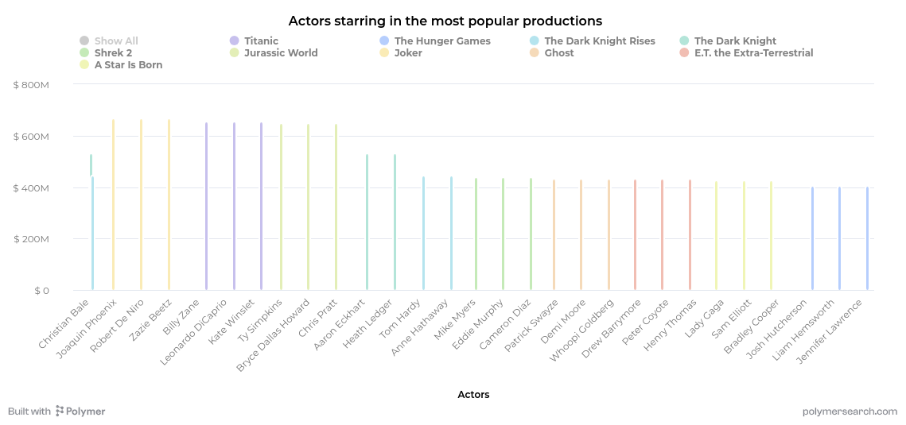

```{r setup, include=FALSE}
knitr::opts_chunk$set(echo = TRUE)
```


```{r read data}
library(magrittr)
library(dplyr)
library(tidyverse)
data <- read.csv("CreditCard.csv")
netflix_data = read.csv("https://raw.githubusercontent.com/kflisikowski/ds/master/netflix-dataset.csv?raw=true")
```
#### Ex1 is the last one as table is super long and I don't know if we supposed to have so many months

## Ex2 First
```{r first}

netflix_data %>%
  filter(grepl("Poland", Country.Availability) & grepl("Polish", Languages)) %>%
  ggplot(aes(x = IMDb.Score, fill = Series.or.Movie, alpha=0.5)) +
  geom_histogram() 

```

## Ex2 Second
```{r second}

netflix_data %>%
  filter(grepl("Poland", Country.Availability) & grepl("Polish", Languages)) %>%
  ggplot(aes(x = IMDb.Score, fill = Series.or.Movie, alpha=0.5)) +
  geom_density()


```

## Ex2 Third
```{r third}

popular_language <- netflix_data %>% 
  separate_rows(Languages, sep=", ") %>%
  select(Title,Languages)

popular_language <- popular_language %>%
  group_by(Languages) %>%
  transmute(count = n()) %>%
  distinct() %>%
  arrange(desc(count)) %>% 
  head(12) 

  ggplot(popular_language,aes(x=Languages,y=count)) +
  geom_col()
```


## Challenge 1
```{r challenge 1}



```


## Challenge 2
```{r challenge 2 data, message=FALSE, warning=FALSE}

long_data <- netflix_data %>%
  select(Series.or.Movie,Hidden.Gem.Score,IMDb.Score,Rotten.Tomatoes.Score,Metacritic.Score) %>%
  pivot_longer(cols = c(Hidden.Gem.Score,IMDb.Score,Rotten.Tomatoes.Score,Metacritic.Score), names_to="Score_Type", values_to = "Value")
 
long_data <- long_data %>% drop_na()

frequency_data <- long_data %>%
  group_by(Series.or.Movie, Score_Type, Value) %>%
  summarise(Frequency = n())

```


### Plot for "IMDb.Score", "Hidden.Gem.Score" as they have the range 10
```{r challenge 2.1}
frequency_data %>%
  filter(Score_Type %in% c("IMDb.Score", "Hidden.Gem.Score")) %>%
  ggplot(aes(x = Value, y = Frequency, color = Score_Type)) +
  geom_line() +
  facet_wrap(Series.or.Movie ~ Score_Type, ncol = 2) +
  scale_y_continuous(trans = "log10") +
  labs(x="Score Value")

```

### Plot for "Rotten.Tomatoes.Score", "Metacritic.Score" as they have the range 100
```{r challenge 2.2}
frequency_data %>%
  filter(Score_Type %in% c("Rotten.Tomatoes.Score", "Metacritic.Score")) %>%
  ggplot(aes(x = Value, y = Frequency, color = Score_Type)) +
  geom_line() +
  facet_wrap(Series.or.Movie ~ Score_Type, ncol = 2) +
  scale_y_continuous(trans = "log10") +
  labs(x="Score Value")
```


## Challenge 3
```{r preapre data}
netflix_data <- netflix_data %>%
  mutate(Production.House = strsplit(as.character(Production.House), ",\\s*")) %>%
  unnest(Production.House)

netflix_data$Release.Date <- as.Date(netflix_data$Release.Date, "%m/%d/%Y") 
netflix_data <- netflix_data[!is.na(netflix_data$Release.Date), ]  

netflix_data$Year <- as.integer(format(netflix_data$Release.Date, "%Y"))

```


```{r 3.1}
#
netflix_data <- netflix_data %>%
  mutate(Production.House = ifelse(Production.House == "Columbia Pictures Corporation", "Columbia Pictures", Production.House)) %>%
  mutate(Production.House = ifelse(Production.House == "Warner Bros.", "Warner Brothers", Production.House))


# Summarize total productions by production house
total_productions <- netflix_data %>%
  group_by(Production.House) %>%
  summarise(Total_Count = n(), .groups = 'drop') %>%
  arrange(desc(Total_Count)) %>%
  top_n(10, Total_Count)

# Filter the original data to include only the top 10 production houses
filtered_data <- netflix_data %>%
  filter(Production.House %in% total_productions$Production.House)


# Summarize by year and production house
summary_data <- filtered_data %>%
  group_by(Year, Production.House) %>%
  summarise(Count = n(), .groups = 'drop')
```

```{r plot-size, fig.width=10, fig.height=6 }
# Create a line chart
ggplot(summary_data, aes(x = as.factor(Year), y = Count, color = Production.House, group = Production.House)) +
  geom_line() +
  geom_point() +  # Optional: add points to each data point
  theme_minimal() +
  labs(x = "Year", y = "Number of Productions", color = "Production House",
       title = "Annual Production Count by Top 10 Studios") +
  theme(axis.text.x = element_text(angle = 90, hjust = 1),
        plot.title = element_text(hjust = 0.5))


```


```{r total production}

ggplot(total_productions, aes(x = reorder(Production.House, Total_Count), y = Total_Count, fill = Production.House)) +
  geom_bar(stat = "identity") +
  theme_minimal() +
  labs(x = "Production House", y = "Total Productions", 
       title = "Total Productions by Top 10 Studios") +
  theme(axis.text.x = element_text(angle = 45, hjust = 1),
        plot.title = element_text(hjust = 0.5)) +
  guides(fill=guide_legend(title="Production House"))

```

## Ex 1
```{r calculate mean}
library(kableExtra)
dane <- data %>%
  group_by(months) %>%
  filter(card=="yes")%>%
  summarise(mean = mean(expenditure)) %>%
  distinct() 

styled_table <- kable(dane, format = "html", caption = "Summary of Monthly Expenditure") %>%
  kable_styling(full_width = FALSE) %>%
  add_header_above(c("Monthly Expenditure" = 2), align = "center") %>%
  column_spec(1, bold = TRUE) %>%
  column_spec(2, width = "5em")

styled_table

```

